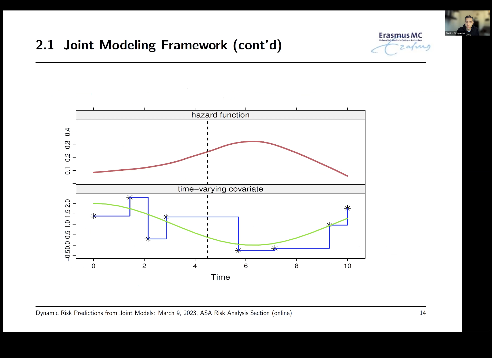

## ASA Dynamic Risk Predictions Workshop notes
* JMbayes website (with examples): https://drizopoulos.github.io/JMbayes2/

### Part 1: Introduction
* Explicit outcomes: multiple longitudinal responses. time-to-events
* Implicit outcomes: missing data, random visit times
* Research question with AIDS dataset: how strong is the association between CD4 
cell count and the risk of death?

* Research question with PBC dataset: how strong is the association between bilirubin and the risk of death, can it be used for predictions of survival probabilities

When to use separate analysis (only concerns either survival/longitudinal):
* Does treatment affect survival?
* Are average longitudinal evolutions different between males and females? 

When to use joint analysis:
* Complex effect estimation: how strong is the association between the longitudinal evolution of CD4 cell counts and the hazard of death? 
  * Time-varying covariates vs. endogenous
* Handling implicit outcomes: focus on longitudinal outcomes with dropouts and random visit times

### Part 2: The joint-model
Framework:
* Use model to describe the evolution of the covariate
* Fit longitudinal data into cox model


* Think about fitting the green line into the hazard function
* Random effects explains all interdependencies in the data
  * Longitudinal outcome is independent of TTE outcome
  * Repeated measurements in longitudinal are independent of each other

* For cox model in joint, requires full specification of joint distribution
  * Use spline as a flexible model for baseline hazard
  
* jm() function assumes that the ordering of the patients is the same, and that the time unit is the same

* Great explanation of function at 1:10

* endogeneous: inside patients, such as bio markers
* extrogeneous: outside patients, such as nurse caring for patient, hospital

### Part 3: Functional forms
* Instantaneous markers are not always optimal, sometimes other functional forms are needed to accurately model
  * Time dependent 
  * Cumulative effects (can be weighted)
* functional form is specified by `functional_forms`
  * `area()` calculates the cumulative effect
  * `slope()` calculates the time-dependent slope
  
### Part 4: Dynamic predictions
Dynamic prediction: survival probabilities are dynamically updated as additional longitudinal information is recorded

Fitted model estimates conditional survival probabilities

Model accounts all measurements present and before, but not in the future. Obviously becomes more accurate with more measurements

Predictions at 2:05

Functional forms have an effect on predictions, so choose the optimal one according to a model selection problem

Model can predict using new data, does not get re-run 

Accuracy for predictions:
* Discrimination: classifying high-risk and low-risk patients
  * Interested in events occuring in a medically-relevant interval
  * sensitivity, AUC and ROC curve
  * Use function `tvROC()`
* Calibration: how well the joint model can accurately predict future events
  * Use a calibration plot: `calibration_plot()`
* Brier score: combining discrimination and calibration
  * Lower brier score is better 
  * Calculate using `tvBrier()`
  * Take the square root of the brier score to find the average probability difference (less than 5% is good)
* To measure predictive ability, validation sets are needed

### Practical run-through
Dataset: `prothro`, Liver Cirrhosis dataset
```{r}
library("JMbayes2")

# linear mixed effects model
lmeFit <- lme(pro ~ time + time:treat, data = prothro, random = ~ time | id)

# cox model
CoxFit <- coxph(Surv(Time, death) ~ treat, data = prothros)

# joint-model
jointFit <- jm(CoxFit, lmeFit, time_var = "time") 
# add functional_forms argument to specify functional form

summary(jointFit)
```
* Rule of thumb: Rhat needs to be below 1.1. If not, increase the number of iterations for MCMC

Extract the data of patient 155
```{r}
dataP155 <- prothro[prothro$id == 155, ]
dataP155$Time <- dataP155$death <- NULL # delete variable as we want to predict this
```

Note: if you want another longitudinal biomarker, need to make another linear model for it

Prediction plot
```{r}
sfit <- predict(jointFit, newdata = dataP155[1, ], process = "event", 
                times = seq(0, 10, length.out = 51),
                return_newdata = TRUE)

sfit
```

Plotting prediction plot
```{r}
plot(sfit)
```

Predicting the longitudinal outcome
```{r}
Lpred <- predict(jointFit, newdata = dataP155[1, ],
                 times = seq(0, 10, length.out = 51),
                 return_newdata = TRUE)

plot(Lpred)
```

Combining the plots
```{r}
plot(Lpred, sfit)
```

Dynamic predictions
```{r}
n <- nrow(dataP155)
for (i in seq_len(n)) {
  Spred <- predict(jointFit, newdata = dataP155[1:i, ],
                   process = "event", times = seq(0, 10, length.out = 51),
                   return_newdata = TRUE)
  Lpred <- predict(jointFit, newdata = dataP155[1:i, ],
                   times = seq(0, 10, length.out = 51),
                   return_newdata = TRUE)
  plot(Lpred,Spred)
}
```

ROC at 3 years with 1 year window
```{r}
roc <- tvROC(jointFit, newdata = prothro, Tstart = 3, Dt = 1)
plot(roc)
```

AUC at 3 years with 1 year window
```{r}
tvAUC(roc)
```

Calibration plot at 3 years with 1 year window
```{r}
calibration_plot(jointFit, newdata = prothro, Tstart = 3, Dt = 1)
```

Brier score at 3 years with 1 year window
```{r}
tvBrier(jointFit, newdata = prothro, Tstart = 3, Dt = 1)
```
### Concluding remarks
* Pay attention to:
  * Model longitudinal flexibly using splines
  * Consider functional form for joint model
  
## Tuning longitudinal data through splines
Spline overview: https://rpubs.com/alecri/review_longitudinal

* Linear spline: divide axis into segments and consider piecewise-linear trends. 

* Locations where lines are tied together are known as knots.

Data: Study of 162 girls on body fat percentage pre-menarcheal and post-menarcheal
```{r}
# loading packages
library(labelled)   # labeling data
library(rstatix)    # summary statistics
library(ggpubr)     # convenient summary statistics and plots
library(GGally)     # advanced plot
library(car)        # useful for anova/wald test
library(Epi)        # easy getting CI for model coef/pred
library(lme4)       # linear mixed-effects models
library(lmerTest)   # test for linear mixed-effects models
library(emmeans)    # marginal means
library(multcomp)   # CI for linear combinations of model coef
library(geepack)    # generalized estimating equations
library(ggeffects)  # marginal effects, adjusted predictions
library(gt)         # nice tables
library(tidyverse)

# load data
load(url("http://alecri.github.io/downloads/data/bodyfat.RData"))

head(bodyfat)
```

```{r}
# trajectories overtime
ggplot(bodyfat, aes(agec, pbf)) +
  geom_line(aes(group = id)) +
  geom_smooth(se = FALSE, size = 2) +
  geom_vline(xintercept = 12.86, linetype = "dashed") + 
  labs(x = "Age, years", y = "Percent Body Fat")
```

```{r}
# fitting model
bodyfat <- bodyfat %>%
  mutate(timepost = pmax(time, 0))
lin_lspl0 <- lmer(pbf ~ time + timepost + (time + timepost | id), data = bodyfat)
summary(lin_lspl0)
```

```{r}
# slopes pre-menarcheal and post-menarcheal
K <- rbind(
  "population mean pre-menarcheal slope" = c(0, 1, 0),
  "population mean post-menarcheal slope" = c(0, 1, 1)
)
tidy(glht(lin_lspl0, linfct = K), conf.int = TRUE)
```

```{r}
sid <- c(4, 16)
expand.grid(
  time = seq(-6, 4.1, 0.05),
  id = sid
) %>%
  mutate(timepost = pmax(time, 0)) %>%
  bind_cols(
    indiv_pred = predict(lin_lspl0, newdata = .),
    marg_pred = predict(lin_lspl0, newdata = ., re.form = ~ 0)
  ) %>%
ggplot(aes(time, indiv_pred, group = id, col = factor(id))) +
  geom_line(aes(y = marg_pred), col = "black", lwd = 1.5) +
  geom_line(aes(linetype = "BLUP")) + #empirical best linear unbiased prediction
  geom_point(data = filter(bodyfat, id %in% sid),
             aes(y = pbf, shape = factor(id), col = factor(id))) +
  guides(shape = "none") +
  labs(x = "Time relative to menarche, years", y = "Percent Body Fat",
       col = "Id", linetype = "Prediction")
```


Source: http://users.stat.umn.edu/~helwig/notes/smooth-spline-notes.html

Data: prestige of Canadian occupations from 1971 along with average income

```{r}
# load data
library(car)

data(Prestige)
head(Prestige)
```
```{r}
# plot data
plot(Prestige$income, Prestige$prestige,
     xlab = "Income", ylab = "Prestige")
```

```{r}
# fit model
library(npreg)

mod.ss <- with(Prestige, ss(income, prestige))
mod.ss

summary(mod.ss)
```

```{r}
plot(mod.ss, xlab = "Income", ylab = "Prestige")
with(Prestige, points(income, prestige))
```

## Review on survival models
Source: https://www.geeksforgeeks.org/survival-analysis-in-r/

Survival analysis is the prediction of events at a specified time. 

There are two methods of survival analysis in R:
* Kaplan-Meier 
* Cox proportional hazard model

### Kaplan-Meier 
Used for censored data, not based on underlying probability distribution
```{r}
library(survival)
lung
```

Fitting the model
```{r}
survival_function = survfit(Surv(lung$time, lung$status == 2) ~ 1)
survival_function
```

Plotting the function
```{r}
plot(survival_function, main = "Kaplan-Meier", xlab = "Number of days", 
     ylab = "Prob of survival")
```

### Cox proportional hazard model
Uses the hazard function, which considers independent variables in regression.

Also does not assume an underlying probability, but assumes that the hazards are constant over time.

More useful to measure instantaneous risk of deaths, often delivers better results because more volatile with data and features.

Tends to drop sharper as time increases. 
```{r}
cox_mod <- coxph(Surv(lung$time, lung$status == 2) ~., data = lung)

summary(cox_mod)
```

Fitting the model and plotting
```{r}
cox <- survfit(cox_mod)

plot(cox, main = "Cox proportional hazard model", xlab = "Number of days", 
     ylab = "Prob of survival")
```

## More advanced example of survival models
Source: https://rviews.rstudio.com/2017/09/25/survival-analysis-with-r/

Loading the data and packages
```{r}
library(survival)
library(ranger)
library(ggplot2)
library(dplyr)
library(ggfortify) ## for better survival plots

data(veteran)
head(veteran)
```

### Kaplan Meier Analysis
```{r}
km <- with(veteran, Surv(time, status))
head(km, 80)
```

Fitting model with estimates at 1, 30, 60, and 90 days
```{r}
km_fit <- survfit(Surv(time, status) ~ 1, data = veteran)
summary(km_fit, times = c(1, 30, 60, 90*(1:10)))
```

Plotting
```{r}
autoplot(km_fit)
```

Survival curves by treatment
```{r}
km_trt_fit <- survfit(Surv(time, status) ~ trt, data = veteran)
autoplot(km_trt_fit)
```
 
Plotting patients by age
```{r}
vet <- mutate(veteran, AG = ifelse((age < 60), "LT60", "OV60"),
              AG = factor(AG),
              trt = factor(trt, labels = c("standard", "test")),
              prior = factor(prior, labels = c("NO", "Yes")))

km_AG_fit <- survfit(Surv(time, status) ~ AG, data = vet)
autoplot(km_AG_fit)
```

### Cox analysis
Fitting model
```{r}
cox <- coxph(Surv(time, status) ~ trt + celltype + karno + diagtime + age
             + prior, data = vet)
summary(cox)
```

Plotting
```{r}
cox_fit <- survfit(cox)
autoplot(cox_fit)
```

### Notes on cox regression models
* Need to be cautious when interpreting results because it assumes covariates are constant, and in many cases there are not

* Hazard: the rate at which events happen. CPH assumes hazards are constant over time

* Hazard ratio: ratio of hazard between covariates (such as male/female)

* Look more into Concordance stats if wanting to use ROC curves to assess model performance

Aalen's additive regression model shows how covariates change over time
```{r}
aa_fit <- aareg(Surv(time, status) ~ trt + celltype +
                  karno + diagtime + age + prior, data = vet)

aa_fit
```
```{r}
autoplot(aa_fit)
```

## Tuning cox proportional hazards regression
Source: https://www.youtube.com/watch?v=TrS2M5imOt8&t=9s

* `exp(coef)` shows the hazard ratio
  * for quantitative variables, the hazard ratio compares a 1 unit difference
* Concordance: goodness of fit for coxph models. Percentage of cases that model gets correct (50% is random guessing)
* Try to improve concordance score by adding variables, testing nested models?


## additional research on JMbayes2 model
Source: https://drizopoulos.github.io/JMbayes2/articles/JMbayes2.html
Primary function is `jm()`

### Basic use example
Goal: to assess the strength of the association between the risk of death and levels of serum bilirubin
```{r}
library(JMbayes2)
pbc2.id$status2 <- as.numeric(pbc2.id$status != 'alive')
CoxFit <- coxph(Surv(years, status2) ~ sex, data = pbc2.id)
```

Describe patient profiles for biomarker using a linear mixed model
```{r}
fml <- lme(log(serBilir) ~ year * sex, data = pbc2, random = ~ year | id) 
```

Linking survival and longitudinal models
```{r}
jointFit1 <- jm(CoxFit, fml, time_var = "year")
summary(jointFit1)
```

* Assume the instantaneous risk of an event at a specific time $t$ is associated with the value of the linear predictor of the longitudinal outcome at the same point $t$

Traceplots:

* MCMC stands for Markov chain Monte Carlo

* Traceplots are used to determine how many iteration it will take to summarize the posterior distribution (convergence) (think Bayes and conditional probabilities)
  * If model converges, then traceplot moves around the mode of distribution
```{r}
ggtraceplot(jointFit1, "alphas")
```

Density plot
```{r}
ggdensityplot(jointFit1, "alphas")
```